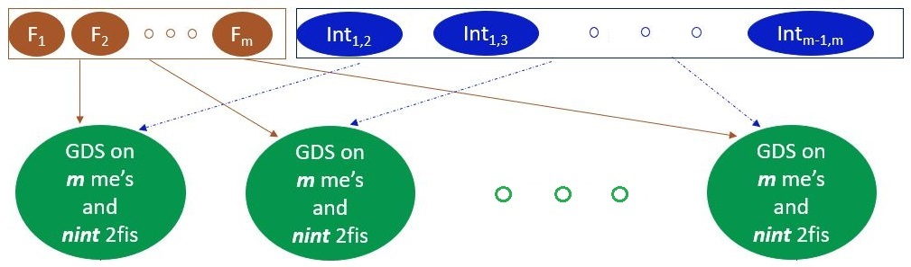

# Gauss - Dantzig Selector: Aggregation over random models (GDS-ARM)



#### *Rakhi Singh, agrakhi@gmail.com*
#### *John Stufken, jstufken@uncg.edu*

<!-- badges: start -->

[](https://cran.r-project.org/package=GDSARM)
[](https://github.com/agrakhi/GDSARM/actions/workflows/R-CMD-check.yaml)
[](https://github.com/agrakhi/GDSARM/actions/workflows/pkgdown.yaml)
[](https://github.com/agrakhi/GDSARM/actions/workflows/r.yml)
[](https://ci.appveyor.com/project/agrakhi/GDSARM/branch/main)
[](https://cranlogs.r-pkg.org/badges/grand-total/GDSARM)

<!-- badges: end -->

Screening experiments are useful for screening out a small number of truly impor-
tant factors from a large number of potentially important factors. The Gauss-Dantzig
Selector (GDS) is often the preferred analysis method for screening experiments. Just
considering main-effects models can result in erroneous conclusions, but including in-
teraction terms, even if restricted to two-factor interactions, increases the number of
model terms dramatically and challenges the GDS analysis. We propose a new analysis method, 
called Gauss-Dantzig Selector Aggregation over Random Models (***GDS-ARM***), which performs a GDS analysis on multiple models that include only some
randomly selected interactions. Please see [Singh and Stufken (2022)](https://arxiv.org/abs/2205.13497) for more details.

## Development status

This package is available in CRAN. The programs are in stable development phase. Any major changes to include factors at more than two-levels will be added over time.

## Installation

```{r}
install.packages("GDSARM")
```

The latest version of the package under development can be installed from GitHub:

```{r}
install.packages("devtools")
library(devtools)
remotes::install_github("agrakhi/GDSARM")
```

### Bug reports

Please submit any bugs or issues (or suggestions) using the [issues](https://github.com/agrakhi/GDSARM/issues) tab of the repo.

## Usage

The main functions users will use are `GDSARM` and `GDS_givencols`. `GDSARM` is the main method. `GDS_givencols` is the helper function which helps user to run GDS on only main effects and on main effects plus all two-factor interactions.

```{r}
library(GDSARM)

data(dataHamadaWu)
X = dataHamadaWu[,-8]
Y= dataHamadaWu[,8]
delta.n=10
n = dim(X)[1]
m = dim(X)[2]
nint = ceiling(0.2*choose(m,2))
nrep = choose(m,2)
ntop = max(20, nint*nrep/(2*choose(m,2)))
pkeep = 0.25 
cri.penter = 0.01
cri.premove = 0.05
design = X
# GDS-ARM with default values
GDSARM(delta.n,nint, nrep, ntop,pkeep, X, Y,cri.penter, cri.premove)

# GDS-ARM with default values but with weak heredity
opt.heredity="weak" 
GDSARM(delta.n,nint, nrep, ntop,pkeep, X,Y,cri.penter, cri.premove,opt.heredity)


data(dataHamadaWu)
X = dataHamadaWu[,-8]
Y= dataHamadaWu[,8]
delta.n=10
# GDS on main effects 
GDS_givencols(delta.n,design = X, Y=Y, which.cols = "main")

# GDS on main effects and two-factor interactions
GDS_givencols(delta.n,design = X, Y=Y)
```

Check out the vignettes for more examples and details.

## License

This package is released in the public domain under the General Public License [GPL](https://www.gnu.org/licenses/gpl-3.0.en.html). 

## References

Singh, R. and Stufken, J. (2022). Factor selection in screening experiments by aggregation over random models, 1--31. https://arxiv.org/abs/2205.13497
